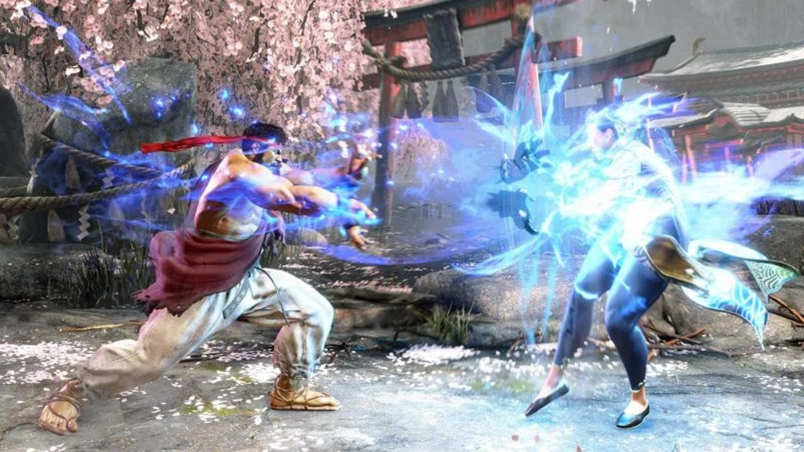

# Ryandeep Shelopal - Lab 1
[interests](#these-are-my-other-interests)

## _Hello, I am a fourth year computer engineering major!_
* My favorite cs class so far is **CSE30**
  - My favorite programming language is **c++** as it was my first!
* These are the classes I attended today on wednesday
  - [x] CSE110
  - [x] CSE140
  - [ ] CSE140L
  - [ ] ECE109
* [This is a screenshot from my readme md file] (110-lab-/README.md)
  - I had a hard time using `git push` because i did not have a ssh key

## _These are my other interests_
**1.** Video Games
  
   > ~~Hadoken!~~

**2.** Gym
  
   > I workout here [RIMAC](https://recreation.ucsd.edu/)

